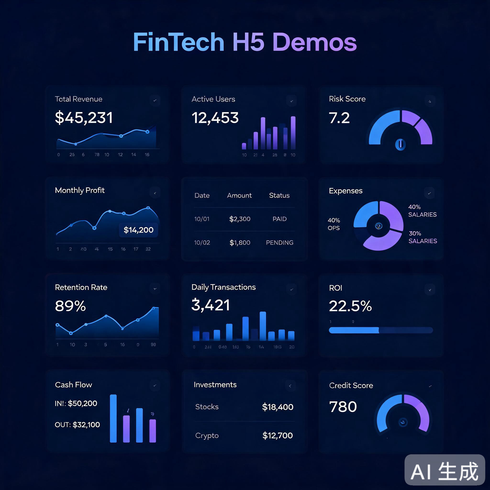
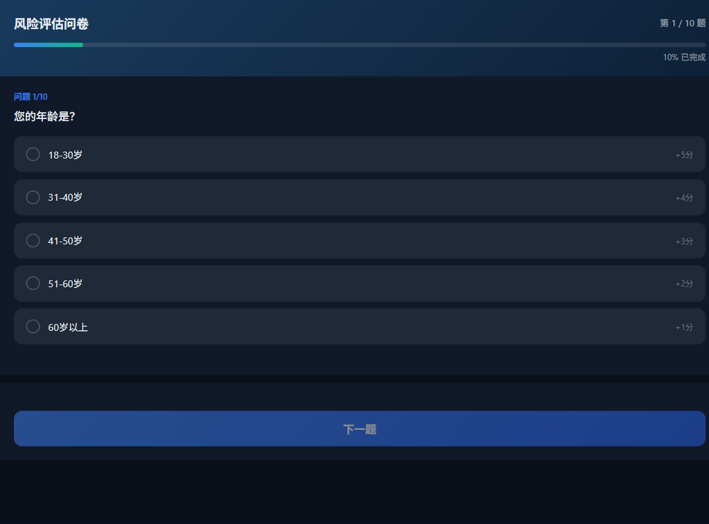
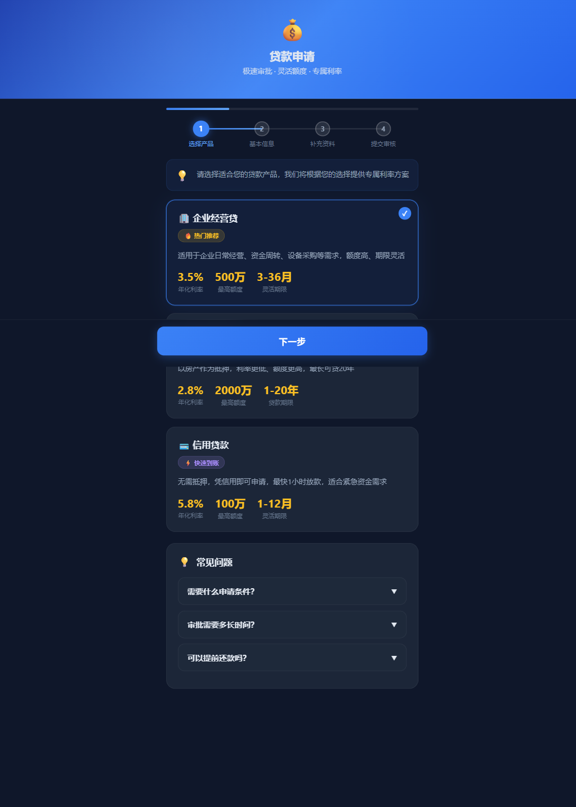
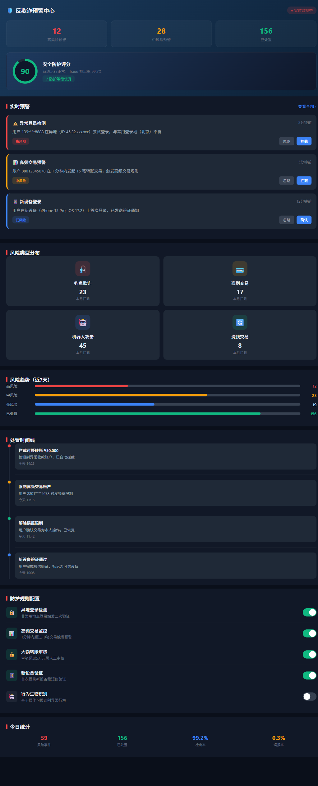

# FinTech H5 Demos

<p align="center">
  
  
  
  
  <a href="https://yuzhaopeng-up.github.io/fintech-h5-demos/"></a>
</p>

**12 zero-dependency financial H5 dashboards. Dark theme, offline capable, responsive. Pure HTML/CSS/JS — no frameworks, no build tools.**

## Live Demo

Try all 12 demos instantly: **[https://yuzhaopeng-up.github.io/fintech-h5-demos/](https://yuzhaopeng-up.github.io/fintech-h5-demos/)**

## Preview

<p align="center">
  
</p>

| Demo | Description | Screenshot |
|------|-------------|------------|
| **Risk Assessment** | Real-time risk scoring dashboard |  |
| **Loan Application** | Digital loan form with smart validation |  |
| **Fraud Alert** | Fraud detection monitoring panel |  |
| **Account Management** | Customer account overview | ⬡ |
| **Supply Chain Finance** | Invoice tracking & payment scheduling | ⬡ |
| **Approval Flow** | Multi-level approval workflow | ⬡ |
| **Notification Center** | Centralized alert management | ⬡ |
| **Data Visualization** | Charts & trend analysis | ⬡ |
| **Data Report** | KPI cards, summary tables | ⬡ |
| **Customer Profile** | 360-degree customer view | ⬡ |
| **Wealth Preservation** | Portfolio & performance metrics | ⬡ |
| **API Test Console** | Lightweight API testing tool | ⬡ |

## Features

- **Zero Dependencies** — Pure HTML + CSS + JavaScript, no npm/node required
- **Offline Capable** — No CDN or external resource dependencies
- **Dark Theme** — Professional dark-mode design (#0a0f1a base)
- **Responsive** — Works on desktop and mobile
- **Self-Contained** — Each demo is a single HTML file, just open in browser

## Quick Start

```bash
# Clone
git clone https://github.com/yuzhaopeng-up/fintech-h5-demos.git

# Open any demo directly in browser
open risk-assessment/index.html

# Or serve locally
python -m http.server 8080
# Then visit http://localhost:8080
```

## Ecosystem

| Repo | Description |
|------|------------|
| [financial-ai-skills](https://github.com/yuzhaopeng-up/financial-ai-skills) | 104 financial AI skills |
| [skill-framework](https://github.com/yuzhaopeng-up/skill-framework) | L0-L4 skill governance framework |
| [soe-compliant-office](https://github.com/yuzhaopeng-up/soe-compliant-office) | 17 SOE-compliant office skills |
| [teleagent-skills](https://github.com/yuzhaopeng-up/teleagent-skills) | 5 general business skills |
| [agent-cluster-comm](https://github.com/yuzhaopeng-up/agent-cluster-comm) | 5 agent cluster communication skills |
| **fintech-h5-demos** (this repo) | 12 zero-dependency financial H5 demos |

## License

MIT — See [LICENSE](./LICENSE)
